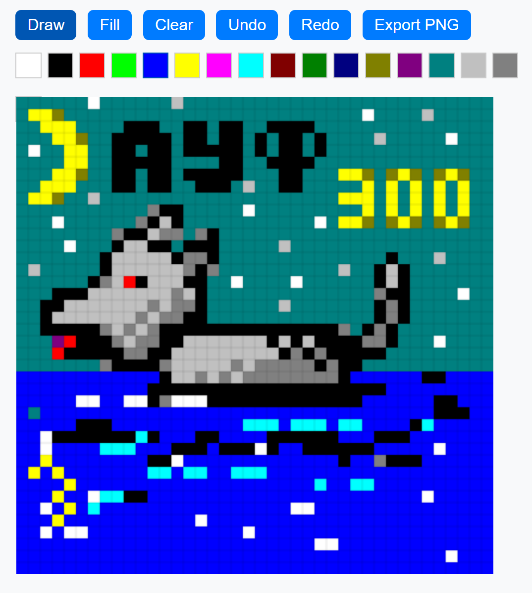
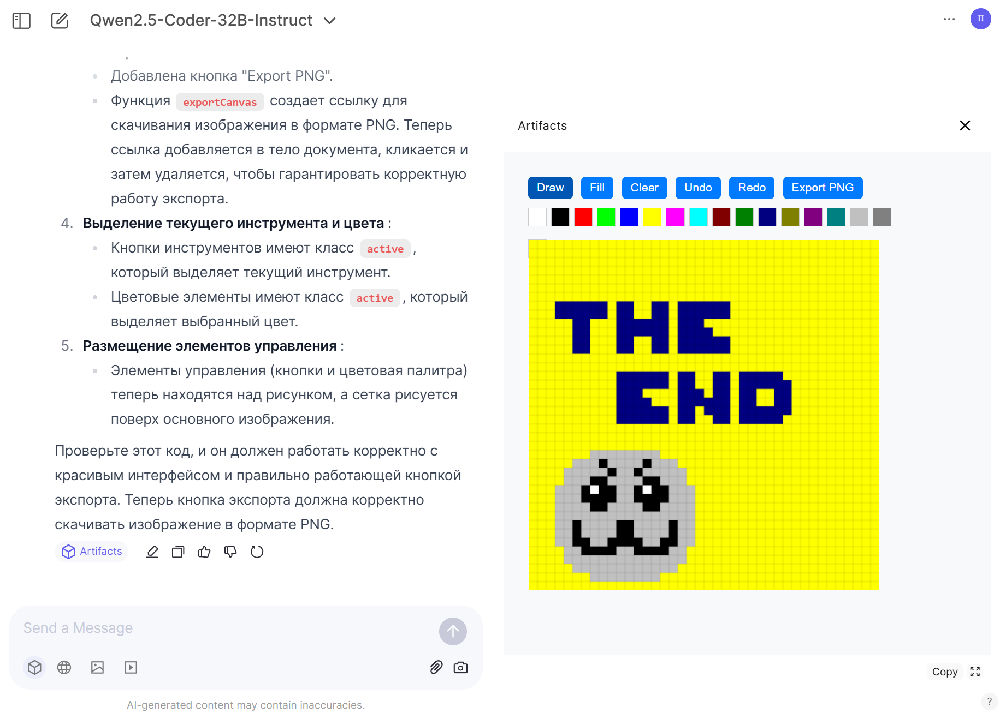

# QwenPixelPaint
## ии написал пиксельный пейнт на стриме

Простой пиксельарт редактор с выбором цвета из 16-цветной палитры, инструментами заливки, отмены и возврата действий, а также экспортом в формат PNG.

## Скриншоты

## Установка и использование
1. Откройте файл `index.html` в браузере.
2. Используйте инструменты в верхней части экрана для рисования.
3. Выберите цвет из палитры.
4. Нарисуйте или заполните области.
5. Используйте кнопки "Undo" и "Redo" для отмены и возврата действий.
6. Нажмите "Export PNG" для экспорта рисунка в формат PNG.
